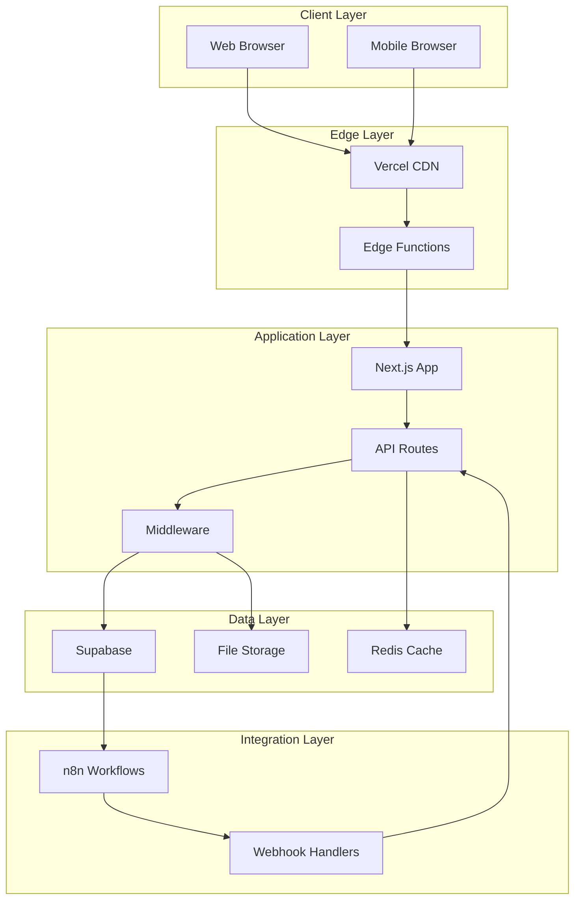
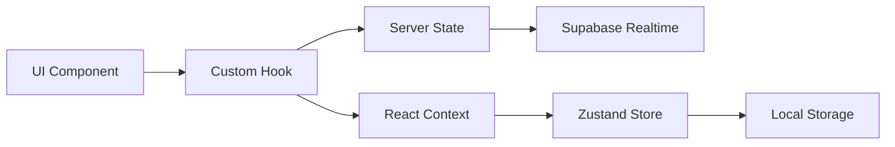
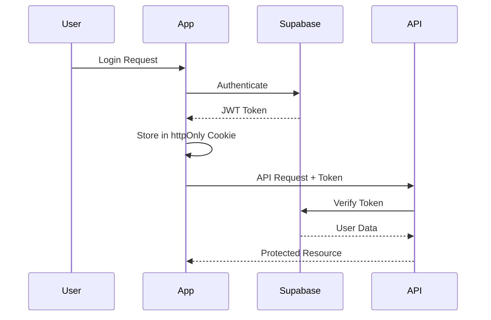
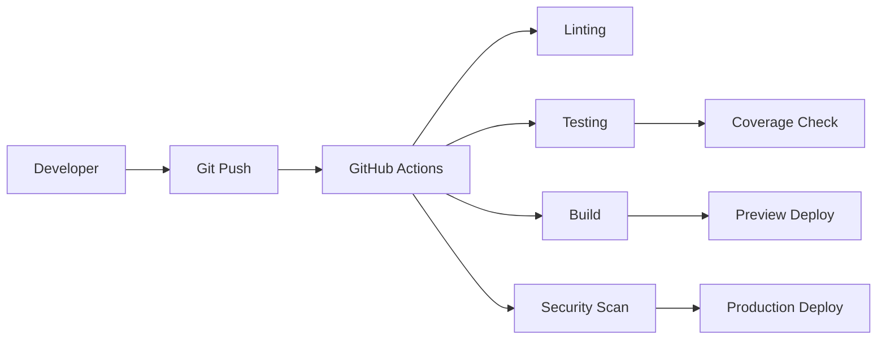

# Architecture Documentation

## System Overview

VOAI Frontend is a modern enterprise web application built with a focus on scalability, maintainability, and developer experience. The system follows a microservices-inspired architecture within a monorepo structure.

## Technology Stack

### Core Technologies

| Technology | Version | Purpose |
|------------|---------|---------|
| **TypeScript** | 5.0+ | Type-safe development across all packages |
| **Next.js** | 14.0+ | React framework with App Router and RSC |
| **React** | 18.3+ | UI component library |
| **Turborepo** | 2.3+ | Monorepo build system and task runner |
| **PNPM** | 8.15+ | Fast, disk space efficient package manager |

### Frontend Technologies

| Technology | Purpose |
|------------|---------|
| **Tailwind CSS** | Utility-first CSS framework |
| **Radix UI** | Headless UI component primitives |
| **Framer Motion** | Animation and gesture library |
| **React Hook Form** | Form state management |
| **Zod** | Schema validation |

### Backend Services

| Service | Purpose |
|---------|---------|
| **Supabase** | Authentication, database, and real-time subscriptions |
| **n8n** | Workflow automation and integration |
| **Vercel** | Hosting and edge functions |
| **Sentry** | Error tracking and performance monitoring |

## Architecture Principles

### 1. Separation of Concerns
- **UI Components**: Isolated in `packages/ui` for reusability
- **Business Logic**: Contained within app-specific modules
- **Configuration**: Centralized in `packages/config`
- **Type Definitions**: Shared across packages

### 2. Type Safety
- Strict TypeScript configuration
- Runtime validation with Zod schemas
- Typed API contracts
- Type-safe environment variables

### 3. Performance First
- Server-side rendering with Next.js App Router
- React Server Components for reduced client bundle
- Optimistic updates for better UX
- Edge caching strategies

### 4. Security by Design
- Content Security Policy (CSP) headers
- CSRF protection
- Input sanitization
- Row Level Security (RLS) in Supabase

## System Architecture



## Component Architecture

### Atomic Design Pattern

We follow the Atomic Design methodology for component organization:

```
packages/ui/
├── atoms/           # Basic building blocks (Button, Input, etc.)
├── molecules/       # Simple components (FormField, Card, etc.)
├── organisms/       # Complex components (Navigation, DataTable, etc.)
├── templates/       # Page layouts
└── tokens/         # Design tokens (colors, spacing, typography)
```

### Component Guidelines

1. **Single Responsibility**: Each component has one clear purpose
2. **Composition over Inheritance**: Use component composition
3. **Props Interface**: Well-defined TypeScript interfaces
4. **Accessibility**: WCAG 2.1 AA compliance
5. **Testing**: Unit tests for all components

## Data Flow Architecture

### State Management



### API Architecture

1. **RESTful API Routes**: `/api/*` endpoints in Next.js
2. **Type-Safe Contracts**: Zod schemas for request/response validation
3. **Error Handling**: Consistent error response format
4. **Rate Limiting**: Protection against abuse
5. **Caching Strategy**: SWR for client-side caching

## Security Architecture

### Authentication Flow



### Security Layers

1. **Network Security**
   - HTTPS only
   - CSP headers
   - CORS configuration

2. **Application Security**
   - Input validation
   - Output encoding
   - CSRF tokens
   - Rate limiting

3. **Data Security**
   - Encryption at rest
   - Encryption in transit
   - Row Level Security
   - Field-level encryption for sensitive data

## Deployment Architecture

### CI/CD Pipeline



### Environment Strategy

| Environment | Purpose | URL |
|-------------|---------|-----|
| **Development** | Local development | http://localhost:3000 |
| **Preview** | PR previews | https://pr-*.vercel.app |
| **Staging** | Pre-production testing | https://staging.voai.app |
| **Production** | Live application | https://app.voai.app |

## Monitoring & Observability

### Monitoring Stack

1. **Application Monitoring**
   - Sentry for error tracking
   - Custom performance metrics
   - Real User Monitoring (RUM)

2. **Infrastructure Monitoring**
   - Vercel Analytics
   - Uptime monitoring
   - Resource usage tracking

3. **Business Metrics**
   - User engagement tracking
   - Feature usage analytics
   - Conversion funnel analysis

## Scalability Considerations

### Horizontal Scaling
- Stateless application design
- Edge function distribution
- CDN for static assets
- Database connection pooling

### Performance Optimization
- Code splitting
- Lazy loading
- Image optimization
- Bundle size monitoring
- Caching strategies

## Future Architecture Considerations

### Planned Enhancements

1. **GraphQL Integration**
   - Consider GraphQL for complex data fetching
   - Type generation from schema

2. **Micro-frontends**
   - Module federation for team scalability
   - Independent deployment of features

3. **Event-Driven Architecture**
   - Event sourcing for audit trails
   - CQRS for complex domains

4. **AI/ML Integration**
   - Vector database for embeddings
   - ML model serving infrastructure

## Architecture Decision Records

Important architectural decisions are documented in [ADRs](./adrs/). Key decisions include:

- [ADR-001](./adrs/0001-monorepo-structure.md): Monorepo with Turborepo
- [ADR-002](./adrs/0002-nextjs-app-router.md): Next.js App Router adoption
- [ADR-003](./adrs/0003-supabase-backend.md): Supabase as BaaS
- [ADR-004](./adrs/0004-component-library.md): Shared component library