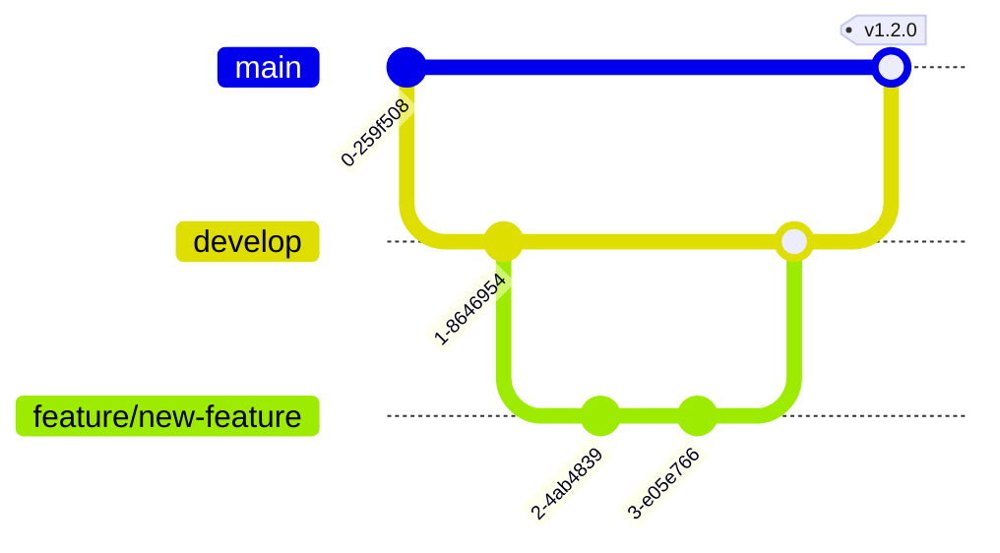

# CI/CD Pipeline Documentation

## Overview

The VOAI Frontend project uses GitHub Actions for continuous integration and Vercel for continuous deployment. Our pipeline ensures code quality, security, and performance standards are met before any code reaches production.

## Pipeline Architecture


## GitHub Actions Workflow

### Workflow Triggers

```yaml
on:
  push:
    branches: [main, develop]
  pull_request:
    branches: [main, develop]
```

### Job Dependencies


## Quality Gates

### 1. Code Quality Gate

| Check | Tool | Threshold | Action on Failure |
|-------|------|-----------|-------------------|
| Linting | ESLint | 0 errors, 0 warnings | Block PR |
| Formatting | Prettier | 100% formatted | Auto-fix |
| Type Safety | TypeScript | 0 errors | Block PR |
| Code Complexity | ESLint | Max 10 | Block PR |

### 2. Test Coverage Gate

```yaml
# Coverage requirements
coverage:
  unit:
    threshold: 80%
    branches: 75%
    functions: 80%
    lines: 80%
    statements: 80%
```

### 3. Performance Gate

| Metric | Threshold | Tool |
|--------|-----------|------|
| Performance Score | ≥ 80 | Lighthouse |
| Accessibility Score | ≥ 90 | Lighthouse |
| Best Practices | ≥ 90 | Lighthouse |
| SEO Score | ≥ 90 | Lighthouse |
| Bundle Size | < 500KB | Webpack |
| First Contentful Paint | < 1.8s | Lighthouse |
| Time to Interactive | < 3.9s | Lighthouse |

### 4. Security Gate

| Check | Tool | Action |
|-------|------|--------|
| Dependency Vulnerabilities | Snyk | High = Block |
| npm Audit | npm | High = Warn |
| OWASP Scan | ZAP | Critical = Block |
| Secret Scanning | GitHub | Any = Block |

## Pipeline Stages

### Stage 1: Validation (Parallel)

#### Linting
```bash
pnpm turbo run lint --concurrency=2
```
- Checks code style
- Enforces best practices
- Validates imports

#### Type Checking
```bash
pnpm turbo run type-check --concurrency=2
```
- Validates TypeScript types
- Checks for type errors
- Ensures type safety

#### Unit Testing
```bash
pnpm turbo run test -- --coverage --maxWorkers=2
```
- Runs Jest tests
- Generates coverage reports
- Uploads to Codecov

### Stage 2: Integration Testing

```bash
# Install Playwright
npx playwright install chromium

# Run integration tests
pnpm turbo run test:integration -- --workers=2
```

### Stage 3: Build

```bash
pnpm turbo run build --concurrency=2
```
- Builds all packages
- Generates production bundles
- Creates build artifacts

### Stage 4: Security Scanning

#### Dependency Scanning
```bash
# Snyk scanning (if token available)
snyk test --severity-threshold=high

# npm audit
pnpm audit --audit-level=high
```

#### OWASP ZAP Baseline
```yaml
- name: OWASP ZAP Scan
  uses: zaproxy/action-baseline@v0.10.0
  with:
    target: 'http://localhost:3000'
    rules_file_name: '.zap/rules.tsv'
```

### Stage 5: Performance Testing

```javascript
// lighthouse.config.js
module.exports = {
  ci: {
    collect: {
      staticDistDir: './apps/frontend/out',
      numberOfRuns: 3,
    },
    assert: {
      assertions: {
        'categories:performance': ['error', { minScore: 0.8 }],
        'categories:accessibility': ['error', { minScore: 0.9 }],
        'categories:best-practices': ['error', { minScore: 0.9 }],
        'categories:seo': ['error', { minScore: 0.9 }],
      },
    },
  },
}
```

### Stage 6: Deployment

#### Preview Deployments (Pull Requests)
```yaml
- name: Deploy to Vercel Preview
  uses: amondnet/vercel-action@v25
  with:
    vercel-token: ${{ secrets.VERCEL_TOKEN }}
    vercel-org-id: ${{ secrets.VERCEL_ORG_ID }}
    vercel-project-id: ${{ secrets.VERCEL_PROJECT_ID }}
```

#### Production Deployment (Main Branch)
```yaml
- name: Deploy to Vercel Production
  if: github.ref == 'refs/heads/main'
  uses: amondnet/vercel-action@v25
  with:
    vercel-token: ${{ secrets.VERCEL_TOKEN }}
    vercel-org-id: ${{ secrets.VERCEL_ORG_ID }}
    vercel-project-id: ${{ secrets.VERCEL_PROJECT_ID }}
    vercel-args: '--prod'
```

## Environment Management

### Environment Strategy

| Environment | Branch | URL | Purpose |
|-------------|--------|-----|---------|
| Development | feature/* | localhost:3000 | Local development |
| Preview | PR | pr-*.vercel.app | PR review |
| Staging | develop | staging.voai.app | Integration testing |
| Production | main | app.voai.app | Live application |

### Environment Variables

```bash
# CI/CD Variables
TURBO_TOKEN          # Turborepo remote cache
TURBO_TEAM          # Turborepo team

# Deployment
VERCEL_TOKEN        # Vercel authentication
VERCEL_ORG_ID       # Organization ID
VERCEL_PROJECT_ID   # Project ID

# Quality Tools
CODECOV_TOKEN       # Code coverage
SNYK_TOKEN          # Security scanning
CHROMATIC_PROJECT_TOKEN # Visual testing

# Application Secrets
NEXT_PUBLIC_SUPABASE_URL
NEXT_PUBLIC_SUPABASE_ANON_KEY
SUPABASE_SERVICE_ROLE_KEY
N8N_API_URL
N8N_API_KEY
```

## Caching Strategy

### Turborepo Remote Cache
```json
{
  "turbo": {
    "remoteCache": {
      "signature": true
    }
  }
}
```

### GitHub Actions Cache
```yaml
- uses: actions/setup-node@v4
  with:
    node-version: 20
    cache: 'pnpm'
```

### Build Cache
- `.next/cache` - Next.js build cache
- `node_modules/.cache` - Various tool caches
- `turbo` cache - Turborepo cache

## Monitoring & Notifications

### Build Status Notifications

1. **GitHub Status Checks**
   - Required checks must pass
   - Visual status on PRs
   - Block merge on failure

2. **Slack Integration** (Optional)
   ```yaml
   - name: Notify Slack
     if: failure()
     uses: 8398a7/action-slack@v3
     with:
       status: ${{ job.status }}
       webhook_url: ${{ secrets.SLACK_WEBHOOK }}
   ```

3. **Email Notifications**
   - On deployment failure
   - On security vulnerabilities
   - Weekly summary reports

### Deployment Tracking

```typescript
// Sentry release tracking
Sentry.init({
  release: process.env.VERCEL_GIT_COMMIT_SHA,
  environment: process.env.VERCEL_ENV,
})

// Custom deployment event
async function trackDeployment() {
  await fetch('/api/deployments', {
    method: 'POST',
    body: JSON.stringify({
      sha: process.env.VERCEL_GIT_COMMIT_SHA,
      environment: process.env.VERCEL_ENV,
      timestamp: new Date().toISOString(),
    }),
  })
}
```

## Rollback Strategy

### Automatic Rollback Triggers

1. **Error Rate Spike**
   - > 5% error rate increase
   - Automatic revert to previous version

2. **Performance Degradation**
   - > 20% increase in response time
   - Alert and manual review

3. **Health Check Failure**
   - `/api/health` endpoint failure
   - Immediate rollback

### Manual Rollback Process

```bash
# Via Vercel CLI
vercel rollback

# Via Vercel Dashboard
# 1. Go to Deployments
# 2. Find previous stable deployment
# 3. Click "Promote to Production"
```

## Best Practices

### 1. Commit Messages
```bash
# Format: type(scope): description
feat(auth): add OAuth provider
fix(ui): resolve button alignment issue
docs(api): update endpoint documentation
chore(deps): upgrade Next.js to v14
```

### 2. Branch Protection Rules
- Require PR reviews (1 minimum)
- Require status checks to pass
- Require branches to be up to date
- Include administrators
- Restrict force pushes

### 3. PR Guidelines
- Fill out PR template
- Link related issues
- Add screenshots for UI changes
- Request appropriate reviewers
- Add labels for categorization

### 4. Release Strategy


## Troubleshooting

### Common Issues

1. **Build Failures**
   ```bash
   # Clear caches
   pnpm clean
   rm -rf .turbo
   rm -rf node_modules
   pnpm install
   ```

2. **Type Errors**
   ```bash
   # Regenerate types
   pnpm turbo run type-check --force
   ```

3. **Test Failures**
   ```bash
   # Run tests locally
   pnpm test --no-cache
   ```

### Debug Mode

```yaml
# Enable debug logging
- name: Build with debug
  env:
    DEBUG: '*'
    NEXT_DEBUG: 'true'
  run: pnpm build
```

## Performance Optimization

### Build Time Optimization

1. **Parallel Jobs**: Run independent tasks in parallel
2. **Caching**: Leverage Turborepo and GitHub Actions cache
3. **Selective Builds**: Only build changed packages
4. **Remote Caching**: Share cache across team

### Pipeline Metrics

| Metric | Target | Current |
|--------|--------|---------|
| Total Pipeline Time | < 10 min | ~8 min |
| Build Time | < 5 min | ~4 min |
| Test Time | < 3 min | ~2 min |
| Deploy Time | < 2 min | ~1 min |

## Security Considerations

### Secret Management
- Use GitHub Secrets for sensitive data
- Rotate secrets regularly
- Limit secret access to required workflows
- Audit secret usage

### Supply Chain Security
- Pin action versions
- Verify action publishers
- Use Dependabot for updates
- Regular security audits

## Future Improvements

1. **Canary Deployments**
   - Gradual rollout to percentage of users
   - Automated metrics comparison
   - Automatic rollback on anomalies

2. **A/B Testing Infrastructure**
   - Feature flag integration
   - Experiment tracking
   - Performance impact analysis

3. **Enhanced Monitoring**
   - Real User Monitoring (RUM)
   - Synthetic monitoring
   - Custom business metrics

4. **Multi-Region Deployment**
   - Geographic distribution
   - Latency optimization
   - Failover strategies