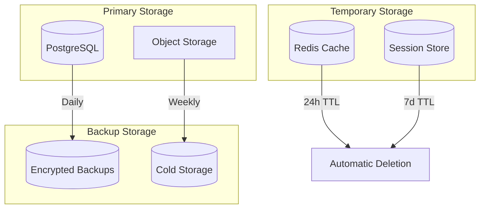

# GDPR & Data Lifecycle Documentation

## Overview

This document outlines VOAI's approach to GDPR compliance and data lifecycle management. We are committed to protecting user privacy and ensuring transparent data handling practices in accordance with the General Data Protection Regulation (GDPR).

## Data Protection Principles

### 1. Lawfulness, Fairness, and Transparency
- Clear privacy policies
- Explicit consent mechanisms
- Transparent data processing

### 2. Purpose Limitation
- Data collected for specific, explicit purposes
- No further processing incompatible with original purpose

### 3. Data Minimization
- Only collect necessary data
- Regular data audits
- Automatic data cleanup

### 4. Accuracy
- User-controlled data updates
- Regular data validation
- Correction mechanisms

### 5. Storage Limitation
- Defined retention periods
- Automatic data deletion
- Archive policies

### 6. Integrity and Confidentiality
- Encryption at rest and in transit
- Access controls
- Security monitoring

### 7. Accountability
- Documentation of processing activities
- Privacy impact assessments
- Regular compliance audits

## Data Collection

### Types of Data Collected

| Data Category | Examples | Legal Basis | Retention Period |
|---------------|----------|-------------|------------------|
| **Account Data** | Email, name, password | Contract | Account lifetime + 30 days |
| **Profile Data** | Avatar, bio, preferences | Consent | Account lifetime |
| **Usage Data** | Page views, features used | Legitimate interest | 90 days |
| **Technical Data** | IP address, browser type | Legitimate interest | 30 days |
| **Communication** | Support tickets, emails | Contract | 2 years |
| **Files** | Uploaded documents | Contract | User-defined + 30 days |

### Consent Management

```typescript
// Cookie consent implementation
export interface ConsentState {
  necessary: boolean      // Always true
  analytics: boolean      // User choice
  marketing: boolean      // User choice
  timestamp: string       // ISO date
  version: string        // Privacy policy version
}

// Consent collection
export function collectConsent(preferences: Partial<ConsentState>) {
  const consent: ConsentState = {
    necessary: true,
    analytics: preferences.analytics || false,
    marketing: preferences.marketing || false,
    timestamp: new Date().toISOString(),
    version: PRIVACY_POLICY_VERSION,
  }
  
  localStorage.setItem('cookie-consent', JSON.stringify(consent))
  updateAnalytics(consent)
  updateMarketing(consent)
}
```

### Data Collection Points

1. **Registration**
   - Email address (required)
   - Name (optional)
   - Password (hashed)

2. **Profile Setup**
   - Company information
   - Role/title
   - Preferences

3. **Usage Tracking**
   - Feature usage (anonymous)
   - Performance metrics
   - Error tracking

4. **File Uploads**
   - File metadata
   - Processing results
   - Access logs

## Data Storage

### Storage Architecture



### Data Encryption

```typescript
// Field-level encryption for sensitive data
export class EncryptedField {
  private static algorithm = 'aes-256-gcm'
  
  static encrypt(value: string): EncryptedData {
    const iv = crypto.randomBytes(16)
    const key = Buffer.from(process.env.FIELD_ENCRYPTION_KEY!, 'hex')
    const cipher = crypto.createCipheriv(this.algorithm, key, iv)
    
    const encrypted = Buffer.concat([
      cipher.update(value, 'utf8'),
      cipher.final(),
    ])
    
    return {
      data: encrypted.toString('hex'),
      iv: iv.toString('hex'),
      tag: cipher.getAuthTag().toString('hex'),
    }
  }
  
  static decrypt(encrypted: EncryptedData): string {
    const key = Buffer.from(process.env.FIELD_ENCRYPTION_KEY!, 'hex')
    const decipher = crypto.createDecipheriv(
      this.algorithm,
      key,
      Buffer.from(encrypted.iv, 'hex')
    )
    
    decipher.setAuthTag(Buffer.from(encrypted.tag, 'hex'))
    
    return Buffer.concat([
      decipher.update(Buffer.from(encrypted.data, 'hex')),
      decipher.final(),
    ]).toString('utf8')
  }
}
```

### Data Retention Policies

```typescript
// Automated retention enforcement
export const retentionPolicies = {
  // User data
  activeUser: null, // No deletion while active
  inactiveUser: 365, // Days before deletion warning
  deletedUser: 30, // Days before permanent deletion
  
  // Content data
  uploadedFiles: 90, // Days after last access
  processedData: 30, // Days after processing
  temporaryFiles: 1, // Days
  
  // Log data
  accessLogs: 90,
  errorLogs: 180,
  auditLogs: 730, // 2 years
  
  // Analytics
  aggregatedAnalytics: 365,
  rawAnalytics: 30,
}
```

## Data Processing

### Processing Activities Record

| Activity | Purpose | Legal Basis | Recipients | Retention |
|----------|---------|-------------|------------|-----------|
| Authentication | Account access | Contract | Auth service | Session |
| File Processing | Service delivery | Contract | AI service | 30 days |
| Analytics | Service improvement | Legitimate interest | Analytics tool | 90 days |
| Email Sending | Communication | Contract/Consent | Email service | 2 years |
| Support | Customer service | Contract | Support team | 2 years |

### Third-Party Processors

1. **Supabase** (Database & Auth)
   - Data Processing Agreement in place
   - EU data residency
   - SOC 2 Type II certified

2. **Vercel** (Hosting)
   - GDPR compliant
   - EU edge locations
   - DPA available

3. **Sentry** (Error Tracking)
   - PII scrubbing enabled
   - EU data residency option
   - Limited data retention

## User Rights Implementation

### 1. Right to Access

```typescript
// Data export endpoint
export async function exportUserData(userId: string) {
  const userData = {
    profile: await getUserProfile(userId),
    files: await getUserFiles(userId),
    activities: await getUserActivities(userId),
    preferences: await getUserPreferences(userId),
  }
  
  // Generate JSON export
  return {
    exportDate: new Date().toISOString(),
    userId,
    data: userData,
  }
}
```

### 2. Right to Rectification

```typescript
// Profile update with audit trail
export async function updateProfile(userId: string, updates: ProfileUpdate) {
  // Validate updates
  const validated = profileSchema.parse(updates)
  
  // Create audit entry
  await createAuditLog({
    userId,
    action: 'profile_update',
    changes: validated,
    timestamp: new Date(),
  })
  
  // Update profile
  return updateUserProfile(userId, validated)
}
```

### 3. Right to Erasure (Right to be Forgotten)

```typescript
// Account deletion workflow
export async function deleteAccount(userId: string) {
  // 1. Soft delete - mark for deletion
  await markAccountForDeletion(userId)
  
  // 2. Send confirmation email
  await sendDeletionConfirmation(userId)
  
  // 3. Schedule hard delete after grace period
  await scheduleHardDelete(userId, 30) // 30 days
  
  // 4. Immediate actions
  await anonymizeAnalytics(userId)
  await revokeAllSessions(userId)
  await disableAccount(userId)
}

// Hard delete implementation
export async function hardDeleteAccount(userId: string) {
  // Delete in correct order to maintain referential integrity
  await deleteUserFiles(userId)
  await deleteUserActivities(userId)
  await deleteUserPreferences(userId)
  await deleteUserProfile(userId)
  await deleteUserAuth(userId)
  
  // Create deletion certificate
  await createDeletionCertificate(userId)
}
```

### 4. Right to Data Portability

```typescript
// Machine-readable data export
export async function exportPortableData(userId: string) {
  const data = await exportUserData(userId)
  
  // Convert to standard formats
  return {
    json: JSON.stringify(data, null, 2),
    csv: await convertToCSV(data),
    xml: await convertToXML(data),
  }
}
```

### 5. Right to Restrict Processing

```typescript
// Processing restriction
export async function restrictProcessing(userId: string, restrictions: string[]) {
  await updateUserPreferences(userId, {
    restrictedProcessing: restrictions,
    restrictedAt: new Date(),
  })
  
  // Apply restrictions immediately
  if (restrictions.includes('analytics')) {
    await excludeFromAnalytics(userId)
  }
  if (restrictions.includes('marketing')) {
    await unsubscribeFromMarketing(userId)
  }
}
```

### 6. Right to Object

```typescript
// Opt-out mechanisms
export async function handleObjection(userId: string, objection: ObjectionType) {
  switch (objection) {
    case 'marketing':
      await optOutOfMarketing(userId)
      break
    case 'profiling':
      await optOutOfProfiling(userId)
      break
    case 'automated_decisions':
      await requireManualReview(userId)
      break
  }
  
  await logObjection(userId, objection)
}
```

## Data Breach Response

### Breach Detection

```typescript
// Automated breach detection
export async function detectDataBreach(event: SecurityEvent) {
  const severity = assessSeverity(event)
  
  if (severity >= BREACH_THRESHOLD) {
    await notifySecurityTeam(event)
    await createIncidentReport(event)
    await initiateBreachProtocol(event)
  }
}
```

### Breach Notification Timeline

1. **0-24 hours**: Internal assessment
2. **24-48 hours**: Legal team notification
3. **48-72 hours**: Supervisory authority notification (if required)
4. **72+ hours**: User notification (if high risk)

### Breach Response Template

```typescript
interface BreachNotification {
  incidentDate: Date
  discoveryDate: Date
  affectedData: string[]
  affectedUsers: number
  riskAssessment: 'low' | 'medium' | 'high'
  mitigationSteps: string[]
  preventionMeasures: string[]
  contactInfo: ContactDetails
}
```

## Privacy by Design

### Development Guidelines

1. **Data Minimization**
   ```typescript
   // Collect only what's needed
   interface MinimalUserData {
     email: string
     // Not collected: phone, address, etc.
   }
   ```

2. **Default Privacy**
   ```typescript
   // Privacy-first defaults
   const defaultPreferences = {
     shareAnalytics: false,
     publicProfile: false,
     marketingEmails: false,
   }
   ```

3. **Purpose Binding**
   ```typescript
   // Tag data with purpose
   interface PurposeTaggedData {
     data: any
     purpose: 'authentication' | 'service' | 'analytics'
     collectedAt: Date
     expiresAt: Date
   }
   ```

## Compliance Monitoring

### Automated Compliance Checks

```typescript
// Daily compliance audit
export async function runComplianceAudit() {
  const checks = [
    checkDataRetention(),
    checkAccessLogs(),
    checkEncryption(),
    checkConsentRecords(),
    checkThirdPartyCompliance(),
  ]
  
  const results = await Promise.all(checks)
  const report = generateComplianceReport(results)
  
  if (report.hasViolations) {
    await notifyDataProtectionOfficer(report)
  }
  
  return report
}
```

### Key Performance Indicators

| KPI | Target | Measurement |
|-----|--------|-------------|
| Data request response time | < 30 days | Average days |
| Consent rate | > 80% | % users consented |
| Data minimization score | > 90% | % necessary fields |
| Encryption coverage | 100% | % encrypted data |
| Breach notification time | < 72 hours | Hours to notify |

## Data Protection Impact Assessment (DPIA)

### When Required

- New processing operations
- Large scale processing
- Systematic monitoring
- Sensitive data processing

### DPIA Template

```markdown
## DPIA: [Processing Operation Name]

### 1. Description
- Nature of processing
- Scope of processing
- Context of processing
- Purpose of processing

### 2. Necessity Assessment
- Is processing necessary?
- Is it proportionate?
- Could less data achieve the same?

### 3. Risk Assessment
- Rights and freedoms risks
- Likelihood and severity
- Risk mitigation measures

### 4. Consultation
- Stakeholders consulted
- Feedback received
- Changes made

### 5. Decision
- Proceed / Modify / Cancel
- Residual risks
- Review date
```

## Contact Information

### Data Protection Officer
- Email: dpo@voai.app
- Phone: +49 (0) 123 456789
- Address: [Company Address]

### Privacy Inquiries
- Email: privacy@voai.app
- Response time: 24-48 hours

### Data Requests
- Portal: https://app.voai.app/privacy
- Email: data-requests@voai.app
- Response time: 30 days maximum