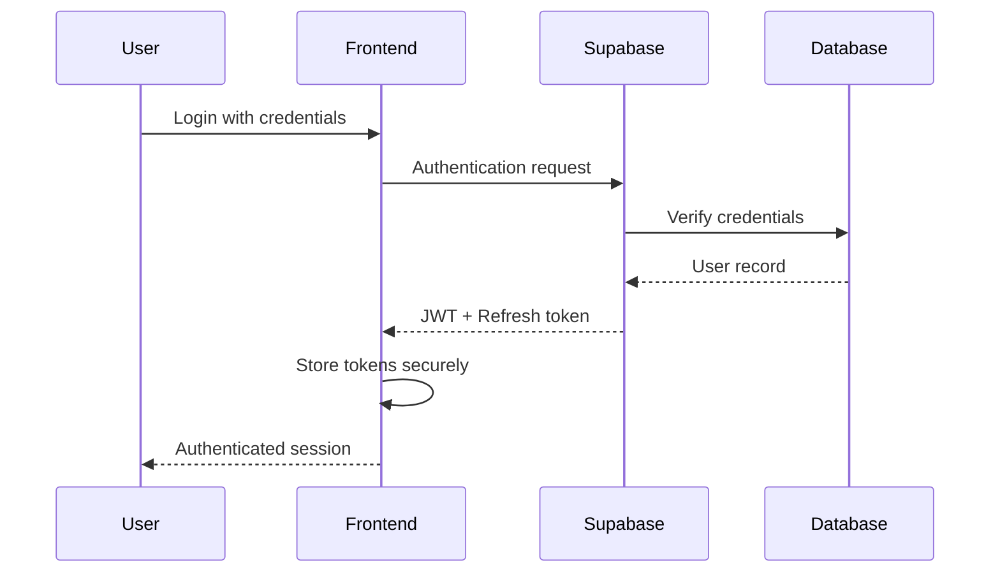

# Security Documentation

## Overview

Security is a fundamental aspect of the VOAI Frontend application. This document outlines the security measures, best practices, and implementation details to ensure the protection of user data and system integrity.

## Security Principles

1. **Defense in Depth**: Multiple layers of security controls
2. **Least Privilege**: Minimal access rights for users and services
3. **Zero Trust**: Verify everything, trust nothing
4. **Security by Design**: Security considered at every stage
5. **Continuous Monitoring**: Active threat detection and response

## Authentication & Authorization

### Authentication Flow



### Token Management

- **JWT Storage**: httpOnly cookies with secure flag
- **Token Rotation**: Automatic refresh token rotation
- **Token Expiry**: 
  - Access token: 1 hour
  - Refresh token: 7 days
- **Revocation**: Immediate token blacklisting on logout

### Session Security

```typescript
// Session configuration
export const sessionConfig = {
  name: 'voai-session',
  secret: process.env.SESSION_SECRET!,
  cookie: {
    httpOnly: true,
    secure: process.env.NODE_ENV === 'production',
    sameSite: 'lax' as const,
    maxAge: 60 * 60 * 24 * 7, // 7 days
    path: '/',
  },
}
```

## Data Protection

### Encryption

#### At Rest
- Database encryption using AES-256
- File storage encryption in Supabase Storage
- Sensitive field encryption using application-level encryption

#### In Transit
- TLS 1.3 for all connections
- Certificate pinning for mobile apps
- End-to-end encryption for sensitive operations

### Data Classification

| Classification | Description | Security Measures |
|----------------|-------------|-------------------|
| **Public** | Marketing content, public docs | Standard HTTPS |
| **Internal** | User-generated content | Authentication required |
| **Confidential** | PII, payment data | Encryption + audit logs |
| **Secret** | API keys, passwords | Vault storage + rotation |

## Security Headers

### Content Security Policy (CSP)

```typescript
const cspHeader = `
  default-src 'self';
  script-src 'self' 'unsafe-eval' 'unsafe-inline' https://vercel.live;
  style-src 'self' 'unsafe-inline';
  img-src 'self' blob: data: https:;
  font-src 'self';
  object-src 'none';
  base-uri 'self';
  form-action 'self';
  frame-ancestors 'none';
  upgrade-insecure-requests;
`
```

### Additional Security Headers

```typescript
export const securityHeaders = [
  {
    key: 'X-DNS-Prefetch-Control',
    value: 'on'
  },
  {
    key: 'Strict-Transport-Security',
    value: 'max-age=63072000; includeSubDomains; preload'
  },
  {
    key: 'X-Frame-Options',
    value: 'SAMEORIGIN'
  },
  {
    key: 'X-Content-Type-Options',
    value: 'nosniff'
  },
  {
    key: 'X-XSS-Protection',
    value: '1; mode=block'
  },
  {
    key: 'Referrer-Policy',
    value: 'origin-when-cross-origin'
  },
  {
    key: 'Permissions-Policy',
    value: 'camera=(), microphone=(), geolocation=()'
  }
]
```

## Input Validation & Sanitization

### Validation Strategy

1. **Client-side validation**: Immediate feedback using Zod
2. **Server-side validation**: Authoritative validation
3. **Database constraints**: Final validation layer

### Implementation Example

```typescript
import { z } from 'zod'
import { sanitizeInput } from '@/lib/security'

// Schema definition
const userInputSchema = z.object({
  email: z.string().email().max(255),
  name: z.string().min(1).max(100).transform(sanitizeInput),
  message: z.string().max(1000).transform(sanitizeInput),
})

// Validation middleware
export async function validateInput(req: Request) {
  try {
    const body = await req.json()
    const validated = userInputSchema.parse(body)
    return { success: true, data: validated }
  } catch (error) {
    return { success: false, error: 'Invalid input' }
  }
}
```

## CSRF Protection

### Implementation

```typescript
// CSRF token generation
import { generateCSRFToken } from '@/lib/security'

export async function GET(request: Request) {
  const token = generateCSRFToken()
  
  return new Response(JSON.stringify({ csrfToken: token }), {
    headers: {
      'Set-Cookie': `csrf-token=${token}; HttpOnly; Secure; SameSite=Strict`,
    },
  })
}

// CSRF validation middleware
export async function validateCSRF(request: Request) {
  const token = request.headers.get('X-CSRF-Token')
  const cookieToken = getCookie(request, 'csrf-token')
  
  if (!token || token !== cookieToken) {
    throw new Error('Invalid CSRF token')
  }
}
```

## Rate Limiting

### Configuration

```typescript
const rateLimitConfig = {
  api: {
    windowMs: 15 * 60 * 1000, // 15 minutes
    maxRequests: 100,
  },
  auth: {
    windowMs: 15 * 60 * 1000, // 15 minutes
    maxRequests: 5,
  },
  upload: {
    windowMs: 60 * 60 * 1000, // 1 hour
    maxRequests: 10,
  },
}
```

## SQL Injection Prevention

### Best Practices

1. **Parameterized Queries**: Always use parameterized queries
2. **Stored Procedures**: Use for complex operations
3. **Input Validation**: Validate all inputs before database operations
4. **Least Privilege**: Database users with minimal permissions

### Example Implementation

```typescript
// Safe query using Supabase
const { data, error } = await supabase
  .from('users')
  .select('*')
  .eq('email', userEmail) // Automatically parameterized
  .single()

// Never do string concatenation
// BAD: `SELECT * FROM users WHERE email = '${userEmail}'`
```

## XSS Prevention

### Strategies

1. **React's Default Protection**: JSX escapes values by default
2. **Content Security Policy**: Restrict script sources
3. **Input Sanitization**: Clean user inputs
4. **Output Encoding**: Encode when displaying user content

### Dangerous Patterns to Avoid

```typescript
// NEVER use dangerouslySetInnerHTML with user input
// BAD: <div dangerouslySetInnerHTML={{ __html: userInput }} />

// GOOD: Let React handle escaping
<div>{userInput}</div>

// If HTML is needed, sanitize first
import DOMPurify from 'isomorphic-dompurify'
const cleanHTML = DOMPurify.sanitize(userHTML)
```

## API Security

### Authentication Middleware

```typescript
export async function authMiddleware(request: Request) {
  const token = request.headers.get('Authorization')?.replace('Bearer ', '')
  
  if (!token) {
    return new Response('Unauthorized', { status: 401 })
  }
  
  try {
    const { data: { user } } = await supabase.auth.getUser(token)
    if (!user) throw new Error('Invalid token')
    
    // Attach user to request context
    return { user }
  } catch (error) {
    return new Response('Unauthorized', { status: 401 })
  }
}
```

### API Rate Limiting

```typescript
import { RateLimiter } from '@/lib/security'

const limiter = new RateLimiter({
  windowMs: 15 * 60 * 1000,
  maxRequests: 100,
})

export async function rateLimitMiddleware(request: Request) {
  const ip = request.headers.get('x-forwarded-for') || 'unknown'
  
  if (!limiter.check(ip)) {
    return new Response('Too Many Requests', { 
      status: 429,
      headers: {
        'Retry-After': '900',
      },
    })
  }
}
```

## File Upload Security

### Security Measures

1. **File Type Validation**: Whitelist allowed MIME types
2. **File Size Limits**: Maximum 10MB per file
3. **Virus Scanning**: Integration with ClamAV
4. **Isolated Storage**: Separate subdomain for file serving
5. **Access Control**: Signed URLs with expiration

### Implementation

```typescript
const allowedMimeTypes = [
  'image/jpeg',
  'image/png',
  'image/gif',
  'application/pdf',
  'text/plain',
]

export async function validateFile(file: File) {
  // Check file size
  if (file.size > 10 * 1024 * 1024) {
    throw new Error('File too large')
  }
  
  // Check MIME type
  if (!allowedMimeTypes.includes(file.type)) {
    throw new Error('Invalid file type')
  }
  
  // Check file extension
  const ext = file.name.split('.').pop()?.toLowerCase()
  const allowedExts = ['jpg', 'jpeg', 'png', 'gif', 'pdf', 'txt']
  if (!ext || !allowedExts.includes(ext)) {
    throw new Error('Invalid file extension')
  }
  
  // Additional magic number validation could be added here
}
```

## Security Monitoring

### Logging Strategy

1. **Authentication Events**: All login attempts
2. **Authorization Failures**: Access denied events
3. **Security Violations**: CSRF, XSS attempts
4. **Data Access**: Sensitive data access logs
5. **API Usage**: Rate limit violations

### Alert Configuration

```typescript
// Sentry configuration for security events
Sentry.init({
  dsn: process.env.NEXT_PUBLIC_SENTRY_DSN,
  integrations: [
    new Sentry.Integrations.Http({ tracing: true }),
  ],
  beforeSend(event, hint) {
    // Filter sensitive data
    if (event.request?.cookies) {
      delete event.request.cookies
    }
    return event
  },
})
```

## Incident Response

### Response Plan

1. **Detection**: Automated alerts via Sentry
2. **Assessment**: Determine severity and scope
3. **Containment**: Isolate affected systems
4. **Eradication**: Remove threat
5. **Recovery**: Restore normal operations
6. **Lessons Learned**: Post-incident review

### Security Contacts

- **Security Team**: security@voai.app
- **Incident Response**: incident@voai.app
- **Bug Bounty**: security-bounty@voai.app

## Compliance

### GDPR Compliance

- User consent management
- Data portability
- Right to deletion
- Privacy by design

### Security Standards

- OWASP Top 10 compliance
- ISO 27001 alignment
- SOC 2 Type II (planned)

## Security Checklist

### Development

- [ ] Input validation on all forms
- [ ] Output encoding for user content
- [ ] CSRF tokens on state-changing operations
- [ ] Authentication on all protected routes
- [ ] Authorization checks for data access
- [ ] Secure headers configuration
- [ ] Dependency vulnerability scanning

### Deployment

- [ ] HTTPS enforcement
- [ ] Security headers enabled
- [ ] Rate limiting configured
- [ ] Monitoring alerts active
- [ ] Backup encryption verified
- [ ] Access logs enabled
- [ ] Incident response plan updated

### Regular Audits

- [ ] Monthly dependency updates
- [ ] Quarterly security assessment
- [ ] Annual penetration testing
- [ ] Continuous vulnerability scanning