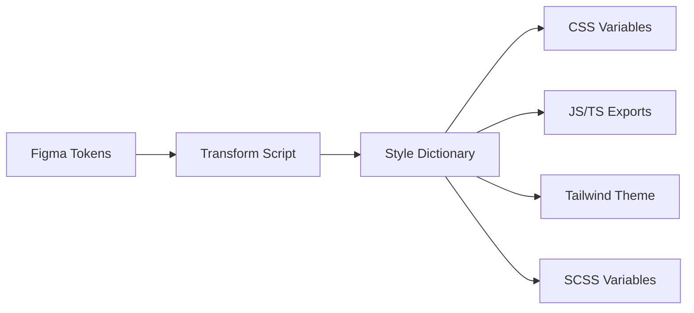

# Figma Tokens Synchronisation

Dieses Dokument beschreibt den Prozess zur Synchronisation von Design Tokens zwischen Figma und dem Code.

## 🎯 Übersicht

Die Figma-Token-Synchronisation ermöglicht es, Design-Entscheidungen direkt aus Figma in die Codebasis zu übertragen. Dies gewährleistet eine konsistente Designsprache zwischen Design und Entwicklung.

## 🔧 Setup

### 1. Figma Tokens Plugin

Installieren Sie das [Figma Tokens Plugin](https://www.figma.com/community/plugin/843461159747178978/Figma-Tokens) in Figma.

### 2. Token-Struktur in Figma

Organisieren Sie Ihre Tokens in Figma wie folgt:

```
Core/
├── Colors/
│   ├── Primary
│   ├── Secondary
│   └── Neutral
├── Typography/
│   ├── Font Families
│   ├── Font Sizes
│   └── Font Weights
├── Spacing/
└── Radius/

Semantic/
├── Light/
│   └── Colors
└── Dark/
    └── Colors
```

### 3. GitHub Secrets

Fügen Sie folgende Secrets in GitHub hinzu:

- `FIGMA_ACCESS_TOKEN`: Personal Access Token von Figma
- `GITHUB_TOKEN`: Automatisch verfügbar (für PR-Erstellung)

## 📋 Workflows

### Manueller Sync

1. Exportieren Sie Tokens aus Figma:
   - Öffnen Sie das Figma Tokens Plugin
   - Klicken Sie auf "Export"
   - Wählen Sie "Single file"
   - Speichern Sie als `.figma-tokens.json`

2. Synchronisieren Sie die Tokens:
   ```bash
   cd external/voai-ui/packages/tokens
   pnpm sync
   ```

3. Bauen Sie alle Token-Formate:
   ```bash
   pnpm build:figma
   ```

### Automatischer Sync

Der automatische Sync läuft:
- Täglich um 2:00 Uhr UTC
- Bei Änderungen an `.figma-tokens.json`
- Manuell über GitHub Actions

## 🏗️ Build-Prozess

### Token-Transformation



### Verfügbare Builds

```bash
# Standard-Build (aus config.js)
pnpm build

# Figma-spezifischer Build (aus config.figma.js)
pnpm build:figma

# Alle Token-Formate synchronisieren
pnpm sync
```

## 📁 Datei-Struktur

```
tokens/
├── .figma-tokens.json      # Export aus Figma
├── figma-tokens.json       # Transformierte Tokens
├── config.js               # Standard Style Dictionary Config
├── config.figma.js         # Figma-spezifische Config
├── scripts/
│   └── sync-figma-tokens.js
└── build/                  # Generierte Dateien
    ├── variables.css
    ├── tokens.json
    ├── tokens.js
    └── tailwind-theme.js
```

## 🎨 Token-Typen

### Unterstützte Token-Typen

- **Colors**: Hex, RGB, RGBA
- **Typography**: Font-Familie, -Größe, -Gewicht, -Zeilenhöhe
- **Spacing**: Pixel, Rem
- **Border Radius**: Pixel, Prozent
- **Shadows**: Box-Shadow-Definitionen
- **Opacity**: 0-1
- **Z-Index**: Numerisch

### Token-Namenskonvention

```
{category}.{property}.{variant}.{state}

Beispiele:
- color.primary.500
- spacing.md
- typography.heading.lg
- shadow.elevation.high
```

## 🔄 CI/CD Integration

### GitHub Action

Die `.github/workflows/figma-tokens-sync.yml` automatisiert:

1. Token-Export aus Figma (wenn API verfügbar)
2. Token-Transformation
3. Build aller Formate
4. PR-Erstellung bei Änderungen

### Pull Request Workflow

Bei Token-Änderungen:
1. Bot erstellt PR mit Änderungen
2. Design-Review erforderlich
3. Tests laufen automatisch
4. Merge nach Freigabe

## 🐛 Troubleshooting

### Häufige Probleme

**Token-Build fehlgeschlagen**
```bash
# Cache löschen und neu bauen
pnpm clean && pnpm build
```

**Transformations-Fehler**
```bash
# Debug-Modus aktivieren
DEBUG=* pnpm sync
```

**Figma-Export-Probleme**
- Überprüfen Sie Token-Namen auf Sonderzeichen
- Stellen Sie sicher, dass alle Tokens einen `type` haben
- Validieren Sie JSON-Syntax

## 📚 Weiterführende Ressourcen

- [Figma Tokens Dokumentation](https://docs.tokens.studio/)
- [Style Dictionary Dokumentation](https://amzn.github.io/style-dictionary/)
- [@tokens-studio/sd-transforms](https://github.com/tokens-studio/sd-transforms)

## 🤝 Contribution

Bei Änderungen am Token-System:
1. Testen Sie lokal mit `pnpm sync`
2. Überprüfen Sie alle generierten Formate
3. Dokumentieren Sie neue Token-Typen
4. Aktualisieren Sie diese Dokumentation